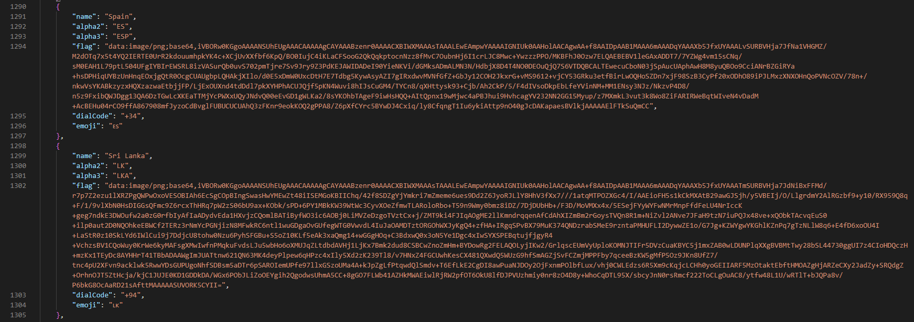

# Countries for developers

This repository contains a JSON file which has 
<ul>
    <li>Country name</li>
    <li>Alpha2 code</li>
    <li>Alpha3 code</li>
    <li>Country flag as a data URL</li>
    <li>Country phone code</li>
    <li>Country flag emoji</li>
</ul>

of all the countries around the world.

!!! All the resources gathered from free and open source sources.